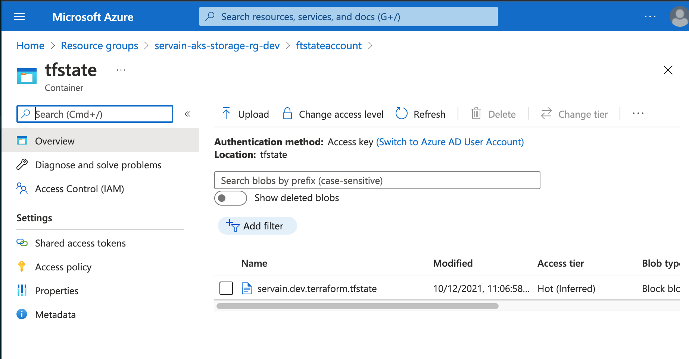
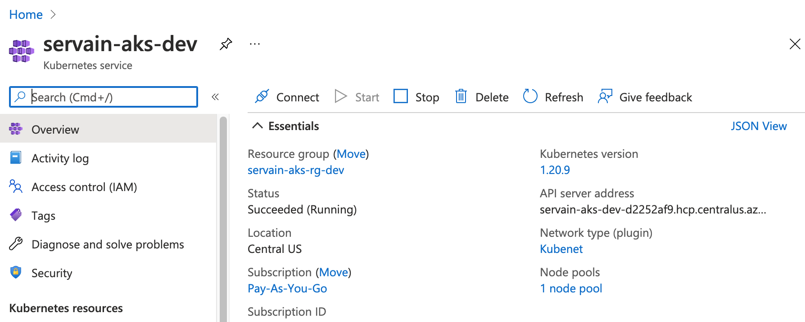
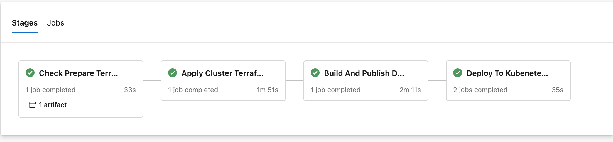

# Repository structure
```
 k8s-app 
    ├── terraform        # terraform directory for create Azure resources
             ├── module  # terraform modelues
                   ├── resource_groups
                             ├── main.tf  
                             ├── variables.tf 
                             └── output.tf      
                   ├── storage_account
                             ├── main.tf  
                             ├── variables.tf 
                             └── output.tf      
                   └──────── aks 
                             ├── main.tf  
                             ├── variables.tf 
                             └── output.tf      
              ├── pre     # create Azure storage to store state in remote backend 
                   ├── remote-storage.tf  
                   ├── variables.tf 
                   └── terraform.tfstate 
              ├── cluster     # create Aks cluster 
                   ├── main.tf  
                   ├── variables.tf 
                   └── terraform.tfstate  
     ├────── k8s         # simple service k8s deployment scripts 
              ├── deployment.yaml
              ├── service.yaml
     ├────── pipelines   # Azure pipeline to auto init, validate, plan, apply terraform 
              ├── job  
                   ├── terraformApply.yaml
              ├── step  
                   ├── terraformTask.yaml
              ├── deployment.yaml
              
```
# Tools Install
1. AzureCLi
2. Terraform

# Terraform Section
## 1. Prepare Step
the /terraform/pre is to create Azure storage account associated with a resource group to store ftstate as cluster terraform backend


in this folder, the ftstate is a shared file. Any resource changes should apply it locally and update ftstate file merge to master
```
cd {local_repo_path}/terraform/pre/
terraform init
terraform plan
# if there are any changes in plan
terraform apply
git add terraform.tfstate
git commit -m "update storage account ftstate"
git push origin {you-branch}
# make a PR to master
```

## 2. Create Azure Cluster Step
/terraform/cluster is to create a auto scaling node pool(1 -3) cluster in Azure associated with a resource group

```
cd {local_repo_path}/terraform/cluster/
terraform init
terraform validate
terraform plan
terraform apply
```

# Kubernetes service deploy
/k8s/deployment.yaml, a simple nginx runs in one conatiner in one pod.
/k8s/service.yaml, pod connect with locadbalance k8s service to allow out access.
```
cd {local_repo_path}/k8s
az aks get-credentials --resource-group edapp-aks-rg-dev  --name edapp-aks-dev
kubectl apply -f deployment.yaml -n default
kubectl apply -f service.yaml -n default
```
after deployment verify
```
kubectl get pods -o wide
kubectl get services -n default
kubectl describe svc my-nginx
```

http://20.106.11.18/

# Azure Pipeline
## set ups
1. create service connection in Azure Devsops projectsettings name as 'Azure Service Manage'

2. create a pipeline with path: k8s-app/pipeline/deployment.yaml
## yaml templates
   - entry: [k8s-app/pipeline/deployment.yaml](k8s-app/pipeline/deployment.yaml) 
   - terraform jobs: [k8s-app/pipeline/job/terraformApply.yaml](k8s-app/pipeline/job/terraformApply.yaml)
   - terraformcli task: [k8s-app/pipeline/step/terraformTask.yaml](k8s-app/pipeline/step/terraformTask.yaml)
  
## pipeline stages
### brief
 2 stages in terraform deploy pipeline
  - Check Prepare Terraform
  - Apply cluster Terraform

### 1. Prepare check stage
workdir: terraform/pre/
  - checkout repo
  -  install terraform in cloud agent 
  -  tf init 
  - tf validate
  - tf plan 
  -  publish .tfplan 
  -  if resource change error ( apply local and udpate tfstate to master)

### 2. Cluster Apply stage
 workdir: terraform/cluster/
 - checkout repo
 - install terraform in cloud agent 
 - tf init 
 - tf validate
 - tf plan 
 - publish .tfplan 
 - tf plan 


