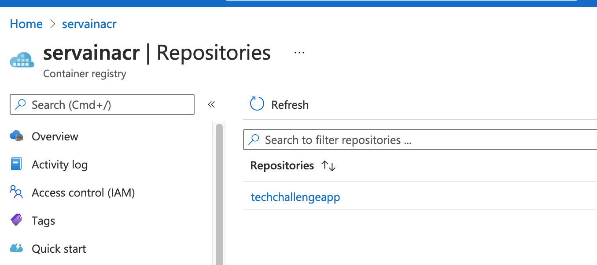
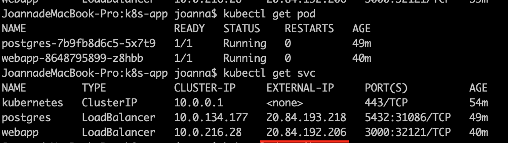

# Repository structure
```
 k8s-app 
    ├── terraform        # terraform directory for create Azure resources
             ├── module  # terraform modelues
                   ├── resource_groups
                             ├── main.tf  
                             ├── variables.tf 
                             └── output.tf      
                   ├── storage_account
                             ├── main.tf  
                             ├── variables.tf 
                             └── output.tf      
                   └──────── aks 
                             ├── main.tf  
                             ├── variables.tf 
                             └── output.tf  
                    └──────── acr 
                             ├── main.tf  
                             ├── variables.tf 
                             └── output.tf 
              ├── pre     # create Azure storage to store state in remote backend 
                   ├── remote-storage.tf  
                   ├── variables.tf 
                   └── terraform.tfstate 
              ├── cluster     # create Aks, Acr, Resource Group for cluster env 
                   ├── main.tf  
                   ├── variables.tf 
                   └── terraform.tfvars 
     ├────── k8s         # simple service k8s deployment scripts 
     		       ├── postgresdb     # postgresDB contianer k8s deployment scripts
                   ├── configmap.yaml
                   ├── persistvoloumn.yaml
                   ├── deployment.yaml
                   └── service.yaml
              ├── app     # servian App contianer k8s deployment scripts
                   ├── configmap.yaml
                   ├── deployment.yaml
                   └── service.yaml
     ├────── pipelines   # Azure pipeline to auto init, validate, plan, apply terraform 
              ├── job  
                   ├── terraformApply.yaml
              ├── step  
                   ├── terraformTask.yaml
              ├── deployment.yaml
```
# Tools Install
1. AzureCLi
2. Terraform

# Terraform Section
## 1. Prepare Step
the /terraform/pre is to create Azure storage account associated with a resource group to store ftstate as cluster terraform backend


in this folder, the ftstate is a shared file. Any resource changes should apply it locally and update ftstate file merge to master
```
cd {local_repo_path}/terraform/pre/
terraform init
terraform plan
# if there are any changes in plan
terraform apply
git add terraform.tfstate
git commit -m "update storage account ftstate"
git push origin {you-branch}
# make a PR to master
```

## 2. Create Azure Cluster Step
/terraform/cluster is to create a auto scaling node pool(1 -3) cluster in Azure associated with a resource group


```
cd {local_repo_path}/terraform/cluster/
terraform init
terraform validate
terraform plan -out tfplan
terraform show -json tfplan >> tfplan.json
terraform apply
```
# docker image build and push to acr
git repo : https://github.com/Joannazhx/TechChallengeApp
changed the net.Listen("tcp", ":{port}") for conatiner localhost
```
az acr login -n servainacr 
docker build . -t servainacr.azurecr.io/techchallengeapp:latest
docker push servainacr.azurecr.io/techchallengeapp:latest
```
# Kubernetes service deploy
k8s/postgresdb, one postgresdb run in one container in one pod and connect with k8s loadbalance type servie for access out cluster, persist voloumn mounted for data storage in pod, env vars use configmap mount to container in pod
k8s/app, servian webapp run in one container in one pod and connect with k8s loadbalance type servie for access out cluster, conf.toml use configmap to mount to conatianer in pod
```
cd {local_repo_path}/k8s
az aks get-credentials --resource-group servain-aks-rg-dev  --name servain-aks-dev --overwrite
# first postgres
kubectl apply -f postgresdb/configmap.yaml
kubectl apply -f postgresdb/persistvoloumn.yaml
kubectl apply -f postgresdb/deployment.yaml
kubectl apply -f postgresdb/service.yaml
# check the postgres pod & servie
kubectl describe pod {}
kubectl exec -it {postgres-pod-name}  -- psql -U postgres
PGPASSWORD=123 psql -h {postgres-service-ip}  -p 5432 -d app -U postgres
# servian webapp
kubectl apply -f app/configmap.yaml
kubectl apply -f app/deployment.yaml
kubectl apply -f app/service.yaml
# check webapp deployment
kubectl describe pod {webapp-pod-name}
```
after deployment verify
```
kubectl get pods -o wide
kubectl get servic -n default
kubectl describe svc {postgres/webapp}
```
postgress pod

webapp pod


k8s servies

http://20.84.192.206:3000

# Azure Pipeline
## set ups
1. create service connection in Azure Devsops projectsettings name as 'Azure Service Manage'

2. create a pipeline with path: k8s-app/pipeline/deployment.yaml
## yaml templates
   - entry: [k8s-app/pipeline/deployment.yaml](k8s-app/pipeline/deployment.yaml) 
   - terraform jobs: [k8s-app/pipeline/job/terraformApply.yaml](k8s-app/pipeline/job/terraformApply.yaml)
   - terraformcli task: [k8s-app/pipeline/step/terraformTask.yaml](k8s-app/pipeline/step/terraformTask.yaml)
  
## pipeline stages
### brief
 2 stages in terraform deploy pipeline
  - Check Prepare Terraform
  - Apply cluster Terraform

### 1. Prepare check stage
workdir: terraform/pre/
  - checkout repo
  -  install terraform in cloud agent 
  -  tf init 
  - tf validate
  - tf plan 
  -  publish .tfplan 
  -  if resource change error ( apply local and udpate tfstate to master)

### 2. Cluster Apply stage
 workdir: terraform/cluster/
 - checkout repo
 - install terraform in cloud agent 
 - tf init 
 - tf validate
 - tf plan 
 - publish .tfplan 
 - tf plan 


